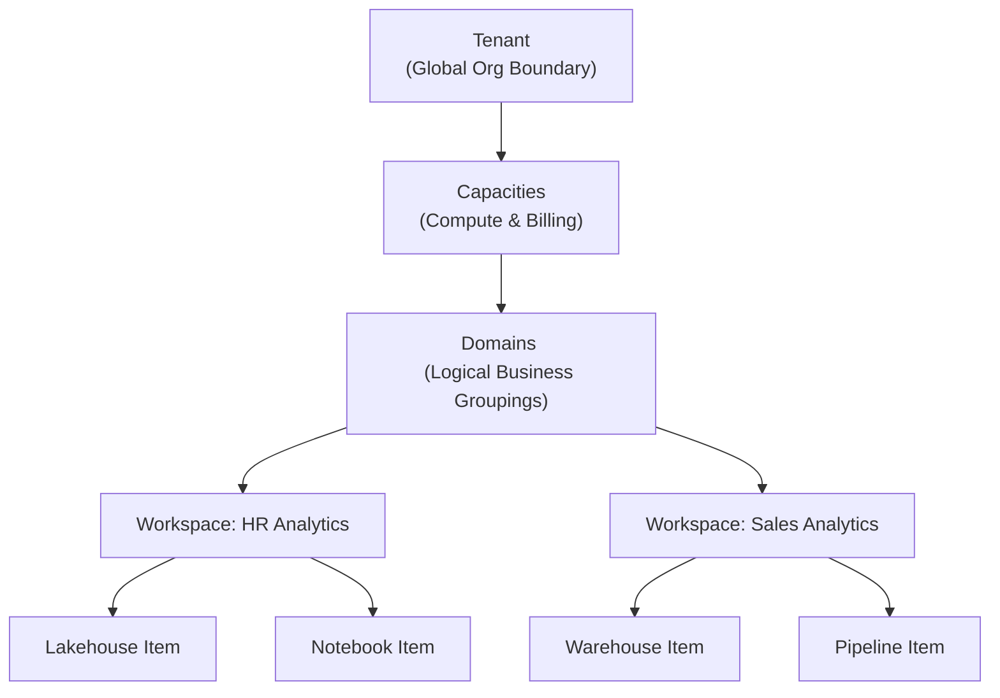

# 01. Admin Settings and Workspaces

Microsoft Fabric operates on a strictly defined hierarchy of structural and administrative boundaries: **Tenant -> Capacities -> Domains -> Workspaces -> Items**. Understanding this hierarchy is essential for both administration and architectural design.

## 1. Domains

**Domain:** A logical way of grouping together all data in an organization that is relevant to a particular area or field (e.g., HR, Finance, Marketing).

- **Purpose:** Grouping by business department allows departments to manage their data according to their specific regulations, security postures, and access needs. It prevents the "data swamp" effect.
- **Association:** Workspaces are mapped to Domains. When associated, all items within the workspace inherit the domain attribute as metadata.
- **OneLake Catalog Integration:** Users can filter content by domain in the OneLake Catalog to easily find data relevant to their department.
- **Delegated Admin:** Fabric allows Tenant Administrators to delegate specific tenant-level settings down to the domain admin level, allowing domain-specific configurations (e.g., specific export restrictions or sharing settings).

![[Pasted image 20260406005958.png]]

## 2. OneLake Architecture

OneLake is often described as the "OneDrive for Data." 
- **Universal Storage:** All data created through Spark or T-SQL (by default) ends up physically stored in OneLake in the open Delta Parquet format.
- **Accessibility:** It can be explored through the Fabric portal online, or accessed locally using the **OneLake File Explorer** (similar to Windows OneDrive sync).
- **One copy of data:** Data in OneLake can be accessed across multiple analytical engines simultaneously (Lakehouse, Warehouse, KQL) without data duplication. This is a core tenet of Fabric.

## 3. Shortcuts and Caching

Shortcuts allow you to reference data sitting elsewhere without physically moving it into OneLake. They are virtual links pointing to external or internal storage.

- **Supported External Sources:** ADLS Gen2, Amazon S3, Google Cloud Storage, or Dataverse.
- **Shortcut Caching:** Caching is available specifically to reduce egress costs and latency for external cloud providers (Amazon S3, Amazon S3-compatible storage, and Google Cloud Storage).
  - **24-hour rule:** If the cached data is not accessed in 24 hours, it is purged from the Fabric cache to save space.
  - **File Size Limit:** 1 GB maximum file size for caching. Files larger than this will not be cached and will be streamed directly.

## 4. Spark Compute Pools

When configuring a workspace for data engineering, you must configure the Spark compute that executes your notebooks and Spark job definitions.

- **Starter Pools:** Fast startup times (usually under 10 seconds). Maintained by Microsoft with pre-defined configurations. Best for quick ad-hoc analysis and exploratory data analysis.
- **Custom Pools:** Allow you to customize node sizes (Small, Medium, Large), auto-scale settings (min/max nodes), and library installations. Useful for heavy, predictable production workloads where you need fine-grained control over resources.

---

## 🧠 Knowledge Check

Test your understanding of Admin Settings & Workspaces:

1. **Scenario:** Your company wants to separate billing and compute resources for the Finance team and the HR team, but still allow them to query each other's data without copying it. What Fabric feature handles the billing/compute separation, and what feature allows querying without copying?
   - *Answer:* Capacities handle the compute and billing separation. OneLake (specifically Shortcuts) allows querying data across workspaces without copying.

2. **Question:** You create a shortcut to an Amazon S3 bucket. A 500 MB file is read by a Spark job. If no one accesses the file for 2 days, what happens to the cached copy in Fabric?
   - *Answer:* It is purged from the cache due to the 24-hour rule for shortcut caching.

3. **Question:** What is the primary difference between a Starter Pool and a Custom Pool in Spark?
   - *Answer:* Starter pools have fast startup times and are managed by Microsoft (less configurable). Custom pools take slightly longer to start but allow custom node sizing, auto-scaling rules, and specific library installations.

---
**Next Topic:** [[02_Lifecycle_Management_CI_CD]]
