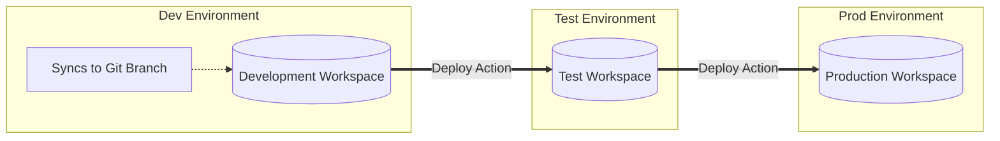

# 02. Lifecycle Management & CI/CD

Managing the lifecycle of your Fabric items (Notebooks, Pipelines, Semantic Models, etc.) is critical for enterprise deployments. Without strict lifecycle management, development changes can inadvertently break production data workflows.

## 1. Version Control (Git Integration)

Fabric supports native Git integration, primarily with **Azure DevOps** (and GitHub for some features).

- **Workspace-Level Sync:** You map a specific Fabric workspace to a specific branch in an Azure Repo. 
  - *Example:* The `Dev-Workspace` is synced to the `main` branch, or a specific `feature-branch`.
- **Supported Items:** Not all Fabric items support Git integration. Supported items include Notebooks, Lakehouses (metadata only, not the data itself), Pipelines, and Power BI Reports.
- **Collaboration:** This enables multiple developers to collaborate on the same codebase using standard Git branching strategies (feature branches, pull requests, code reviews) before syncing changes back into the workspace.

## 2. Deployment Pipelines

Fabric Deployment Pipelines automate the migration of content through different environments, ensuring code is tested before reaching production.

### Key Concepts:
- **Stages:** Typically Dev, Test, and Prod. Each stage is strictly mapped to a completely different Fabric workspace to ensure isolation of data and compute.
- **Deployment Rules:** The most critical feature for CI/CD. Deployment rules allow you to dynamically change parameters, connection strings, or Lakehouse references when moving between stages. 
  - *Example:* A notebook in Dev points to `Dev_Lakehouse`. When deployed to Prod, a deployment rule automatically changes the reference to point to `Prod_Lakehouse` without manual code changes.
- **Selective Deployment:** You don't have to deploy everything. You can select specific modified items (e.g., just one updated notebook) to deploy to the next stage, saving time and reducing risk.

## 3. Database Projects

For Fabric Warehouses or SQL Endpoints, you can manage the schema lifecycle using SQL Database Projects (often managed in Azure Data Studio or Visual Studio).

- **Source of Truth:** The database project (a collection of `.sql` files representing tables, views, and stored procedures) acts as the single declarative source of truth for your database schema.
- **State-Based Deployment:** Deploying the project compares the state of the `.sql` files in your repo against the target database schema, and automatically generates the necessary `ALTER` or `CREATE` scripts to make the target match the repo.

---

## 🧠 Knowledge Check

Test your understanding of Lifecycle Management & CI/CD:

1. **Scenario:** You have a data pipeline that copies data from an Azure SQL database into a Lakehouse. In the Dev workspace, it connects to a Dev SQL server. When you deploy the pipeline to the Prod workspace, it accidentally pulls data from the Dev SQL server. What did you forget to configure?
   - *Answer:* You forgot to configure a **Deployment Rule** for the Prod stage to swap the connection string from the Dev SQL server to the Prod SQL server.

2. **Question:** True or False: Syncing a Lakehouse to a Git repository backs up all the parquet data files inside the Lakehouse.
   - *Answer:* False. Git integration only syncs the *metadata* (schema, item definitions), not the physical data files.

3. **Question:** What is the primary benefit of using a SQL Database Project for a Fabric Warehouse instead of just running `CREATE TABLE` scripts manually?
   - *Answer:* A Database Project provides a declarative "Source of Truth" in source control. Deployments automatically calculate the difference between the code and the target database, generating the necessary migration scripts safely.

---
**Next Topic:** [[03_Security_and_Governance]]
