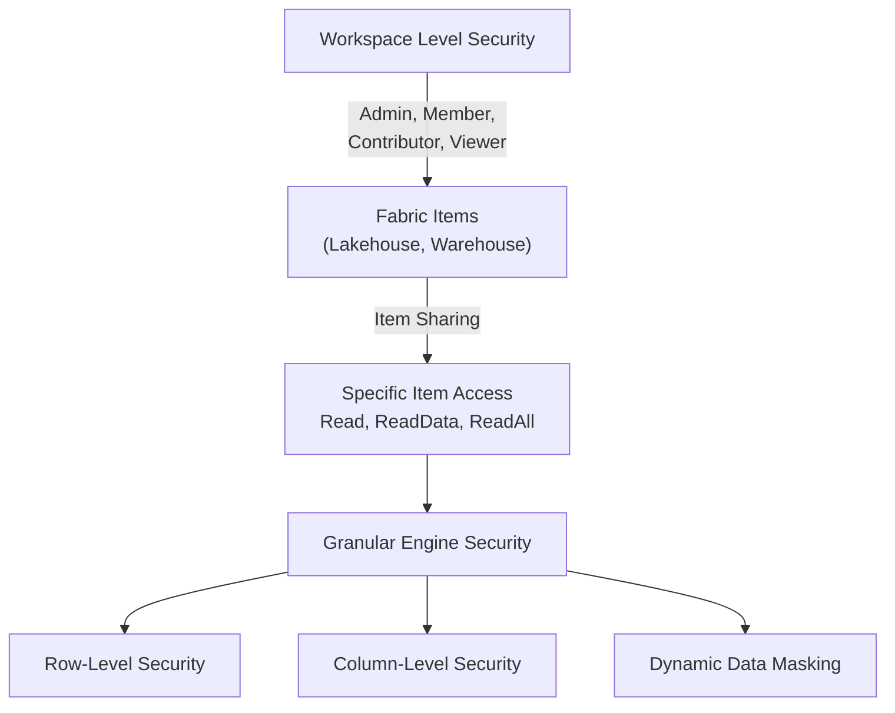

# 03. Security & Governance

Fabric security operates at multiple levels to ensure data is strictly controlled, balancing data democratization with strict compliance.



## 1. Workspace-Level vs Item-Level Access

### Workspace-Level Access (Broad Access)
You manage access to the entire workspace through predefined roles. This applies to all items within the workspace.
- **Admin:** Full control. Can delete the workspace.
- **Member:** Can add/remove members with lower permissions, create/edit/delete items.
- **Contributor:** Can create/edit/delete items but cannot manage users.
- **Viewer:** Can view items and read data (if shared properly), but cannot edit anything.

![[Pasted image 20260328155026.png]]

### Item-Level Access Controls (Narrow Access)
Instead of giving users access to the entire workspace (which might contain sensitive engineering pipelines), you can share specific items (e.g., a single Data Warehouse or Semantic Model).

**Sharing Permissions on a Data Warehouse:**
- **No boxes ticked (Default READ permission):** User can see the warehouse exists in the OneLake data hub, but cannot query data inside.
- **Read all data using SQL (`ReadData`):** User can read all objects within the warehouse using T-SQL queries via the SQL Endpoint.
- **Read all OneLake data (`ReadAll`):** User can bypass the SQL engine and read the warehouse's underlying raw OneLake Parquet files using Apache Spark, pipelines, or local tools.
- **Build Reports:** User can build Power BI reports on top of the default semantic model connected to the warehouse.

## 2. Granular Access Controls

Different engines handle granular access differently, but it is primarily implemented via T-SQL in Warehouses or Lakehouse SQL Endpoints.

### Row-Level Security (RLS)
Filters out specific rows in a table based on the user querying it (e.g., a salesperson can only see their own sales).
- The user/role must already have `SELECT` access to the table.
- Implemented using a Security Policy and an inline Table-Valued Function (Filter Predicate).

```sql
-- 1. Create a security schema
CREATE SCHEMA Security;

-- 2. Create the filter predicate function
CREATE FUNCTION Security.f_FilterRowsForLoggedInUser(@SalesRep AS varchar(100))
RETURNS TABLE
WITH SCHEMABINDING
AS
    RETURN SELECT 1 AS f_FilterResult
    WHERE @SalesRep = USER_NAME(); -- USER_NAME() returns the logged-in user
GO;

-- 3. Apply the security policy to the target table
CREATE SECURITY POLICY SalesRowFilterPolicy
ADD FILTER PREDICATE Security.f_FilterRowsForLoggedInUser(SalesRep) ON Sales.Orders
WITH (STATE = ON);
```

### Dynamic Data Masking (DDM)
Obfuscates sensitive data (like SSNs, emails, or salaries) for non-privileged users *without* changing the underlying physical data on disk. Privileged users (like Admins) can still see the unmasked data.

- **Mask Types:** `default()` (full mask), `email()` (aXXX@XXX.com), `random()` (random number), `partial()` (custom substring).
```sql
ALTER TABLE dbo.EmployeeData
ALTER COLUMN [FirstName] ADD MASKED WITH (FUNCTION = 'PARTIAL(1,"-",2)');
```

### Column-Level and Object-Level Security
- **Column-Level:** Restrict access so a user can query a table but receives an error if they try to `SELECT` a restricted column (unlike DDM, which returns masked data, CLS outright denies access).
  - `GRANT SELECT ON dbo.EmployeeData(EmployeeID, FirstName) TO [DataAnalystRole]`
- **Object-Level:** Restricting access to entire tables or schemas.

## 3. Data Governance

- **Sensitivity Labelling:** Managed centrally in Microsoft Purview. Fabric items can be labeled (e.g., 'Confidential', 'Highly Confidential'). These labels can trigger downstream protection policies (e.g., preventing export to Excel).
- **Endorsement:** Helps users find trustworthy data.
  - **Promoted:** A user marks the item as ready for sharing and reuse.
  - **Certified:** Requires admin approval. Means the item meets strict organizational quality standards.

---

## 🧠 Knowledge Check

Test your understanding of Security & Governance:

1. **Scenario:** A data analyst needs to query tables in a Lakehouse using T-SQL to build ad-hoc reports. They should not be able to modify any notebooks or pipelines in the workspace. Which access method is best?
   - *Answer:* Share the specific Lakehouse item with the analyst and grant them the `ReadData` permission (allowing T-SQL access via the SQL endpoint). Do not add them to a workspace role, as even 'Viewer' might expose too much metadata.

2. **Question:** What is the difference between Column-Level Security (CLS) and Dynamic Data Masking (DDM) regarding user experience?
   - *Answer:* With CLS, if a user queries a restricted column, the query fails with an access denied error. With DDM, the query succeeds, but the data returned in that column is obfuscated (masked).

3. **Question:** You want to implement Row-Level Security on a Warehouse table. What two specific SQL objects must you create to enforce this?
   - *Answer:* An inline Table-Valued Function (to act as the filter predicate) and a Security Policy (to apply the function to the specific table).

---
**Next Topic:** [[04_Orchestration]]
