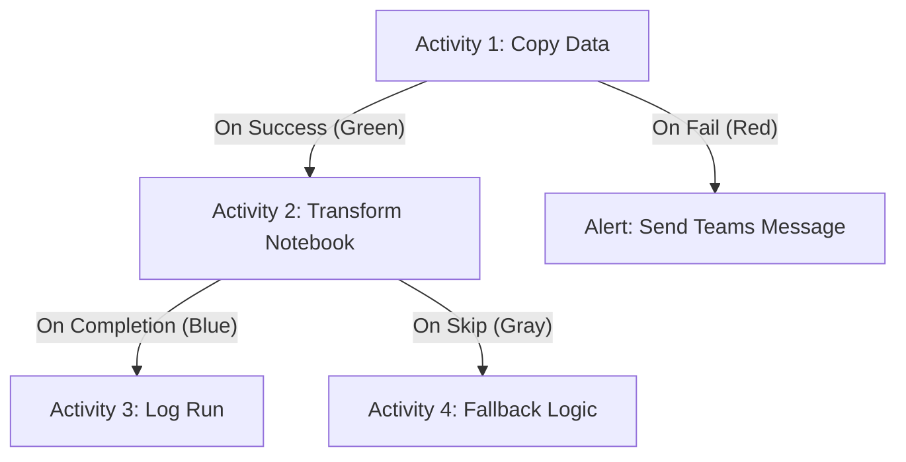

# 04. Orchestration

Orchestration is the process of scheduling, triggering, and managing complex workflows of data tasks. Fabric offers robust orchestration capabilities primarily via Data Pipelines and Notebooks.

## 1. Orchestration Using Data Pipelines

Data pipelines provide a low-code, visual interface to orchestrate the execution of different Fabric items (Notebooks, Scripts, Spark Jobs, KQL scripts, Stored Procedures) and external REST APIs.

### Dependencies Between Activities
You control the execution flow using execution dependency paths. Understanding these is critical for error handling architectures.



- **On Success:** The next activity will run *only* if the previous activity ran successfully.
- **On Fail:** The next activity will run *only* if the previous activity fails. This is crucial for building alerting mechanisms (e.g., sending an email if a copy fails).
- **On Completion:** The next activity will run regardless of whether the previous activity succeeded or failed (often used for logging or cleanup tasks).
- **On Skip:** The next activity runs only if the previous one was skipped (perhaps due to an IF condition evaluating to false).

*Note:* Activities can also be explicitly deactivated if you are debugging a pipeline and want to bypass a step without deleting it from the canvas.

## 2. Orchestration Using Notebooks

From within a notebook, you can execute other notebooks using the `notebookutils` package (specifically `notebookutils.notebook.runMultiple()`). This is highly useful for Data Engineers who prefer code-driven Directed Acyclic Graphs (DAGs) over visual pipelines.

### Example: Code-Driven DAG

```python
from notebookutils import notebook

# 1. Define the DAG structure
# 'activities' is a list of notebooks to run
# 'dependencies' defines the execution order
dag = {
    "activities": [
        {"name": "Extract_Sales", "path": "Notebook_Extract", "timeoutPerCellInSeconds": 120, "args": {"source": "CRM"}},
        {"name": "Extract_HR", "path": "Notebook_Extract", "args": {"source": "Workday"}},
        {"name": "Transform_Join", "path": "Notebook_Transform"}
    ],
    "dependencies": [
        {"source": "Extract_Sales", "target": "Transform_Join"},
        {"source": "Extract_HR", "target": "Transform_Join"}
    ]
}

# 2. Execute the DAG
try:
    print("Starting orchestration...")
    # displayDAGViaGraphviz=True shows a visual map of the execution in the cell output
    results = notebook.runMultiple(dag, displayDAGViaGraphviz=True)
    
    # 3. Access exit values from child notebooks
    for name, result in results.items():
        print(f"Notebook {name} exited with: {result.exitVal}")

except Exception as e:
    print(f"Orchestration failed: {str(e)}")
```

### Spark Session Optimization Tip
- **Session Tags:** If multiple notebooks are executed sequentially from a Data Pipeline, they can share the exact same Spark session using session tags. This entirely avoids the "cold start" delay (which can be 10-30 seconds) for all subsequent child notebooks, vastly improving overall pipeline execution time.

## 3. Triggers

Pipelines and workflows can be run manually, or they can be triggered automatically:
- **Scheduled Triggers:** Run at a specific time or cadence (e.g., hourly, daily at 2 AM).
- **Event-based Triggers:** Run when a specific event occurs, such as a new file arriving in an external Azure Storage account or a blob being deleted.

---

## 🧠 Knowledge Check

Test your understanding of Orchestration:

1. **Scenario:** You have a pipeline with two activities. Activity A is a Copy Activity. Activity B is a Stored Procedure. You want Activity B to run *only* if Activity A fails, so it can log the failure into an audit table. Which dependency path should connect A to B?
   - *Answer:* The **On Fail** (Red) path.

2. **Question:** You are migrating a complex Apache Airflow DAG to Fabric. The DAG involves running 15 different PySpark scripts with complex, dynamic dependencies that change based on data volume. Should you use a visual Data Pipeline or Notebook Orchestration (`notebookutils`)?
   - *Answer:* Notebook Orchestration (`notebookutils`) is better suited for highly complex, dynamic, code-driven DAGs where dependencies might need to be generated programmatically.

3. **Question:** How do Session Tags optimize the orchestration of multiple notebooks triggered by a single data pipeline?
   - *Answer:* Session Tags allow all the notebooks triggered within that pipeline run to share the same underlying Spark cluster session, eliminating the "cold start" overhead time that would normally occur if each notebook requested its own session.

---
**Next Domain:** [[Domain_2_Ingest_and_Transform]]
