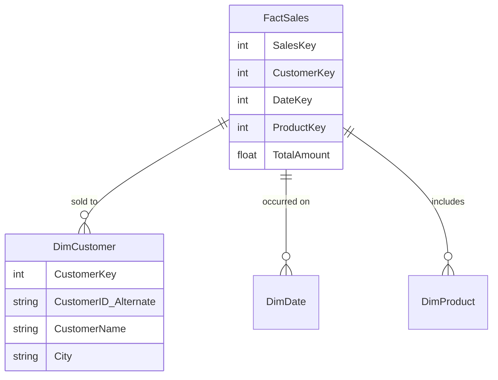

# 05. Batch Ingestion & Transformation

There are multiple ways to ingest and transform batch data in Microsoft Fabric. Choosing the right tool depends heavily on your data volume, the source system, the team's skill set, and the complexity of the transformations required.

## 1. High-Throughput Ingestion (The COPY Statement)

The `COPY` statement is the primary way to ingest high volumes of data into Fabric Warehouse tables efficiently. 
- It performs high-throughput, bulk data ingestion from external Azure storage accounts directly into a warehouse.
- **Features:** It offers flexibility to configure source file format options (e.g., CSV, Parquet), specify a location to store rejected rows (error handling), skip header rows, and manage authentication.

```sql
COPY INTO dbo.TargetTable
FROM 'https://myaccount.blob.core.windows.net/mycontainer/data.csv'
WITH (
    FILE_TYPE = 'CSV',
    FIRSTROW = 2, -- Skip header
    ERRORFILE = 'https://myaccount.blob.core.windows.net/mycontainer/errors/'
);
```

## 2. Ingestion & Transformation Options

When designing a batch architecture, you must choose the right tool for the job.

| Tool | Persona | Best For | Key Characteristic |
| :--- | :--- | :--- | :--- |
| **Data Pipelines (Copy Activity)** | Data Engineer | Ingesting raw data at scale. | Moves data without modifying it. Highly scalable. |
| **Dataflows Gen2** | BI Dev / Citizen Dev | Visual, low-code transformations. | Uses Power Query (M). Easy to use but less scalable than Spark. |
| **Notebooks (PySpark)** | Data Engineer / Scientist | Complex, programmatic logic. | Highly scalable, supports machine learning and custom Python libraries. |
| **T-SQL Stored Procs** | SQL Developer | Data Warehouse transformations. | Best for teams already expert in SQL Server. |

## 3. Dimensional Modeling (Star Schema)

When transforming data for reporting (usually in the "Gold" layer of a Lakehouse or in a Warehouse), the goal is to build a **Star Schema** consisting of Fact tables (events/measurements) and Dimension tables (business entities like Customers or Products).



### Keys in Dimensional Modeling
- **Surrogate Key:** A unique identifier for each row in the dimension table (e.g., `CustomerKey = 1, 2, 3...`). It is an integer value generated automatically by the database. It insulates the data warehouse from changes in the source system.
- **Alternate Key (Business Key):** A natural key that identifies a specific instance of an entity in the transactional source system (e.g., `CustomerID_Alternate = 'CUST-A99'`).

### Handling Slowly Changing Dimensions (SCD)
When business attributes change over time (e.g., a customer moves from New York to Boston):
- **SCD Type 1 (Overwrite):** Overwrite the old value with the new value. The history is lost, but the table remains small and simple.
- **SCD Type 2 (Add Row):** Add a new row with a new surrogate key, and track the active period using `ValidFrom`, `ValidTo`, and `IsCurrent` flag columns. This preserves exact historical context for old sales facts.

---

## 🧠 Knowledge Check

Test your understanding of Batch Ingestion & Transformation:

1. **Scenario:** You need to ingest 500 GB of CSV files from an Azure Data Lake Gen2 storage account into a Fabric Warehouse as quickly as possible. The data does not need any transformation during the load. Which method is the most efficient?
   - *Answer:* The T-SQL `COPY INTO` statement (or a Pipeline Copy Activity) is the most efficient way to bulk load large volumes of raw data into a Warehouse.

2. **Question:** In a Star Schema, what is the purpose of a Surrogate Key in a Dimension table?
   - *Answer:* A Surrogate Key is a meaningless integer (usually auto-generated) that uniquely identifies a row. It insulates the data warehouse from changes in the source system's natural keys and is essential for implementing SCD Type 2 tracking.

3. **Question:** A customer changes their last name due to marriage. You update the `DimCustomer` table by adding a completely new row with the new name, a new Surrogate Key, and mark the old row's `IsCurrent` flag to False. Which type of Slowly Changing Dimension (SCD) is this?
   - *Answer:* SCD Type 2.

---
**Next Topic:** [[06_Streaming_and_Real_Time]]
