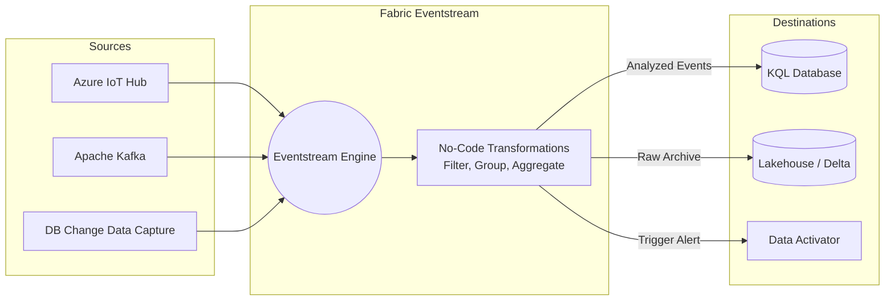

# 06. Streaming & Real-Time

Microsoft Fabric's Real-Time Intelligence (RTI) allows you to process, transform, and take automated action on high-velocity streaming data in near real-time.

## 1. Eventstream in Microsoft Fabric

Eventstream provides a no-code/low-code graphical interface to capture, transform, and route real-time events. (Conceptually, it replaces or wraps the complexity of Apache Kafka, Amazon Kinesis, or Azure Event Hubs).

### Eventstream Sources
Eventstream can ingest data from multiple origins seamlessly:
- **Microsoft Cloud Sources:** Azure Event Hubs, Azure IoT Hubs, Azure Service Bus, and DB Change Data Capture (CDC) feeds.
- **Fabric Internal Events:** Changes to items in a workspace, OneLake data modifications, or Fabric job status events.
- **External Sources:** Apache Kafka clusters, Google Cloud Pub/Sub, MQTT streams.

### Eventstream Transformations
Before routing the data to a destination, Eventstream can apply real-time transformations on the fly:
- **Data Quality Filtering:** Drop invalid or incomplete JSON payloads before they hit your database.
- **Content-based Routing:** Route different subsets of data to different destinations (e.g., error logs go to one Lakehouse folder, successful transactions go to a KQL DB).
- **Data Enrichment:** Add calculated fields, rename cryptic columns, or cast data types.
- **Time-Window Aggregations:** Calculate running totals, averages, or counts over time.
  - *Tumbling Window:* Fixed-sized, non-overlapping intervals (e.g., every 5 minutes).
  - *Sliding Window:* Overlapping intervals that update continuously.

## 2. Automating Actions with Data Activator

Data Activator is the "reflex" engine of Fabric. It allows you to automate actions (like sending an email or triggering a Power Automate flow) based on specific conditions in your streaming data or Power BI reports.

Data Activator operates on four core concepts:
1. **Events:** Each record arriving in a stream represents an event that occurred at a specific time.
2. **Objects:** The data in an event is mapped to a business object (e.g., a Delivery Truck, a Server, a Patient).
3. **Properties:** Fields mapped to represent the state of an object (e.g., `engine_temp`, `cpu_usage`).
4. **Rules:** The logical conditions under which an action is triggered. 
   - *Example Rule:* "If the `engine_temp` property of the `Delivery Truck` object exceeds 200°F for more than 5 minutes, send a Teams message to the fleet manager."

---

## 🧠 Knowledge Check

Test your understanding of Streaming & Real-Time concepts:

1. **Scenario:** You are receiving a stream of JSON messages from IoT thermometers. However, about 5% of the messages have a `temperature` reading of "NULL" due to a sensor glitch. How can you prevent these bad records from entering your KQL database without writing Python code?
   - *Answer:* Use an **Eventstream Transformation** to add a Data Quality Filter that drops any incoming event where the `temperature` field is NULL, before routing it to the KQL database.

2. **Question:** What is the difference between a Tumbling Window and a Sliding Window in stream processing?
   - *Answer:* A Tumbling Window groups events into fixed, non-overlapping time blocks (e.g., 00:00-00:05, 00:05-00:10). A Sliding Window evaluates events continuously over a defined period (e.g., the last 5 minutes from *right now*), meaning windows overlap.

3. **Question:** In Data Activator, if you are monitoring a fleet of rental scooters, what do the individual scooters represent, and what does their current battery level represent?
   - *Answer:* The scooters represent the **Objects**, and their battery level represents a **Property** of those objects.

---
**Next Topic:** [[07_KQL_and_Real_Time_Intelligence]]
