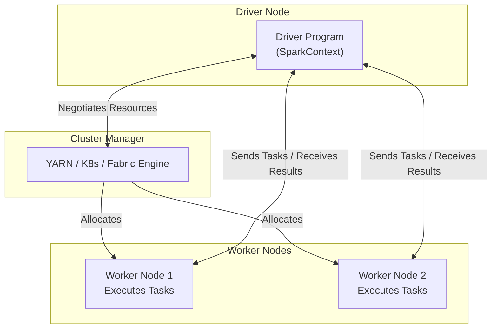

# 08. PySpark & Notebooks

PySpark (the Python API for Apache Spark) is the primary language used in Fabric Notebooks for large-scale, complex data engineering and machine learning workloads.

## 1. Apache Spark Architecture

Spark processes massive datasets by distributing the computation across multiple machines. Understanding this architecture is crucial for troubleshooting performance issues.



- **Driver Program:** The brain of the operation. It translates your Python code into a logical plan, converts it into a physical Directed Acyclic Graph (DAG) of execution stages, and coordinates with the Cluster Manager.
- **Cluster Manager:** Allocates physical resources (CPU cores, Memory) across the cluster.
- **Worker Nodes:** The physical or virtual machines where the processing actually happens.
- **Executors:** Processes running on Worker Nodes. They execute the specific tasks assigned by the Driver and hold cached data in their memory.

## 2. Spark Execution Flow & Optimizations

1. **Submission:** Code is executed, Driver requests resources.
2. **DAG Construction:** Code translates into a physical execution plan.
3. **Task Scheduling:** The DAG scheduler divides the graph into Stages. The task scheduler assigns tasks to executors based on *data locality*.
4. **Execution:** Executors process data and return results.

### Key Spark Optimizations:
- **Lazy Evaluation:** Spark doesn’t actually process any data when you apply transformations (like `.filter()` or `.select()`). It only builds the execution plan. The data is only processed when an *action* is called (like `.show()`, `.count()`, or `.write()`).
- **Data Locality:** Spark attempts to send the compute tasks to the specific worker node that already holds the data on its disk, minimizing network transfer times.
- **In-Memory Computing:** Intermediate results are kept in RAM. It avoids writing to the hard disk between every step, which is what makes Spark much faster than legacy MapReduce.

## 3. Writing Data with PySpark

### Spark SQL
You can mix Python and SQL in the same notebook. To run raw SQL, use the `%%sql` cell magic or `spark.sql()`.
```python
%%sql
CREATE TABLE PatientData (PatientId INT, Name STRING);
```

### Interacting with Delta Tables
Fabric uses the open-source Delta Lake format by default for Lakehouse tables. Delta adds ACID transactions, time travel, and schema enforcement to Parquet files.

You can define schemas programmatically and create Delta tables using the `delta.tables` package.

```python
from delta.tables import DeltaTable
from pyspark.sql.types import StructType, StructField, IntegerType, StringType

# 1. Define strict schema
schema = StructType([
    StructField("PatientId", IntegerType(), True),
    StructField("Name", StringType(), True)
])

# 2. Create the Delta Table in the Lakehouse
DeltaTable.createOrReplace(spark)\
    .tableName("PatientTable")\
    .addColumns(schema)\
    .execute()
```

## 4. Notebook Utilities (notebookutils)

The `notebookutils` package (specifically `mssparkutils`) is a Fabric-specific library that allows you to interact with the Fabric environment securely.

- **File System:** `notebookutils.fs.ls("Files/my_data")`
- **Secret Management:** Accessing Azure Key Vault secrets without hardcoding passwords.
- **Notebook Orchestration:** Running other notebooks via `notebookutils.notebook.runMultiple()`.

![[Pasted image 20260405235028.png]]

---

## 🧠 Knowledge Check

Test your understanding of PySpark & Notebooks:

1. **Scenario:** You write 50 lines of PySpark code applying various filters, joins, and column renames to a 1TB dataframe. When you execute the cell, it finishes in 0.1 seconds. However, when you run `df.count()` in the next cell, it takes 5 minutes. Why?
   - *Answer:* Due to **Lazy Evaluation**. The first 50 lines were just *transformations* (building the execution plan). `df.count()` is an *action*, which actually triggers the Spark engine to execute the plan and process the 1TB of data.

2. **Question:** In the Spark architecture, what component is responsible for translating your Python code into a physical execution plan (DAG)?
   - *Answer:* The **Driver Program**.

3. **Question:** What is the primary advantage of using Delta Lake format over standard Parquet files in a Lakehouse?
   - *Answer:* Delta Lake provides ACID transactions (preventing data corruption during concurrent reads/writes), schema enforcement, and time travel (the ability to query older versions of the data).

---
**Next Domain:** [[Domain_3_Monitor_and_Optimize]]
