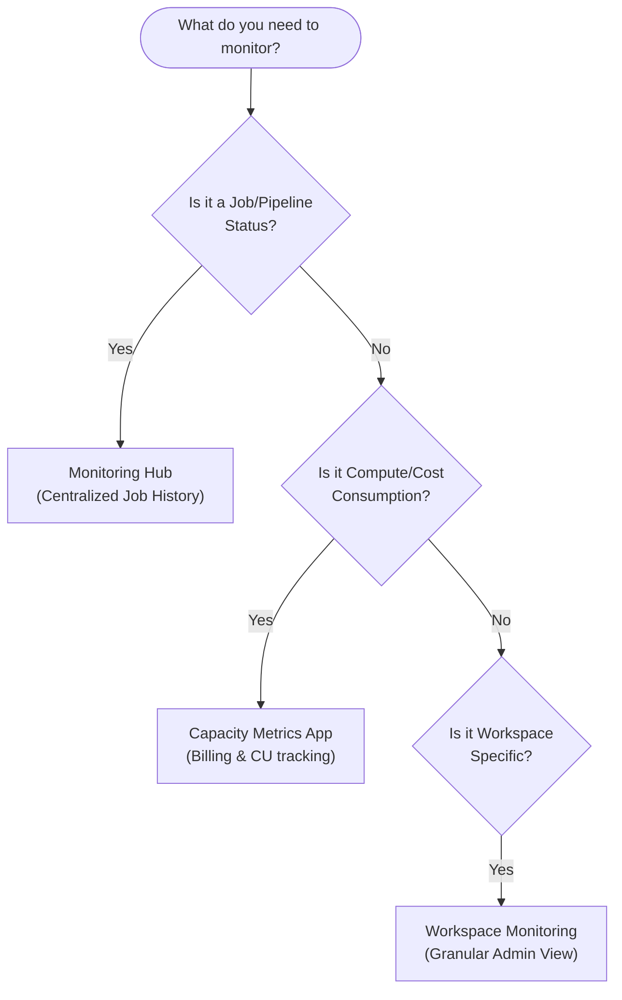

# 09. Monitoring & Alerting

Microsoft Fabric provides several specialized tools to monitor the health, performance, and cost of your data engineering solutions. Knowing which tool to use for which persona is critical.

## 1. The Monitoring Hub

The Monitoring Hub is a centralized, cross-workspace location where Data Engineers can track the status of all active and historical executions.

- **What it monitors:** Background jobs, Data Pipeline runs, Spark notebook executions, Dataflow refreshes, and Semantic Model refreshes across *all* workspaces you have access to.
- **Primary Use Case:** Checking if a nightly batch pipeline succeeded, failed, or is currently hung.
- **Troubleshooting:** You can click directly into a failed job from the Monitoring Hub to view the specific error logs or open the Spark UI.

![[Pasted image 20260701194917.png]]

## 2. The Capacity Metrics App

Fabric is billed based on Capacity Units (CUs) - e.g., an F64 capacity has 64 CUs. The Capacity Metrics App is a pre-built Power BI report provided by Microsoft to help Fabric Administrators understand exactly which items and users are consuming compute.

- **What it monitors:** Compute utilization over time, throttling events, and item-level CU burn rates.
- **Primary Use Case:** Identifying "noisy neighbors" (e.g., a poorly written Spark notebook that is eating up 80% of the entire company's capacity).
- **Throttling:** If your organization consistently exceeds its purchased capacity, Fabric will begin to throttle (delay or reject) background or interactive jobs. The Capacity Metrics App allows you to foresee and prevent throttling.

![[Pasted image 20260702020546.png]]

## 3. Workspace Monitoring

At a more granular level, Workspace Admins can view the run history and performance metrics specifically for items within their own workspace, without needing access to the global Capacity Metrics app.

![[Pasted image 20260702021942.png]]

## 4. Alerting Mechanisms

Proactive monitoring requires automated alerts when things go wrong:
- **Pipeline Alerts:** Use an "On Fail" execution path in a data pipeline to trigger an Office 365 Outlook activity (send email) or a Teams message activity.
- **Data Activator Alerts:** You can configure Data Activator to monitor Power BI datasets or Eventstreams and send alerts if specific conditions are met (e.g., if the number of ingested rows suddenly drops to zero, indicating an upstream failure).

---

## 🧠 Knowledge Check

Test your understanding of Monitoring & Alerting:

1. **Scenario:** Users are complaining that their Power BI reports are loading very slowly, and your data pipelines are taking twice as long to run as they did last week. You suspect the company is hitting its compute limits. Which monitoring tool should you check first?
   - *Answer:* The **Capacity Metrics App**. It will show if you are hitting 100% capacity utilization and experiencing throttling.

2. **Question:** You are a Data Engineer and you want to check the status of 5 different data pipelines spread across 3 different workspaces. You do not have Tenant Admin privileges. What is the fastest way to see all these pipeline statuses in one place?
   - *Answer:* Use the **Monitoring Hub**. It aggregates job statuses across all workspaces you have access to.

3. **Question:** How do you set up a basic email alert if a Data Pipeline fails?
   - *Answer:* Add an Office 365 Outlook activity to the pipeline canvas, and connect it to the failing activity using the red **"On Fail"** dependency line.

---
**Next Topic:** [[10_Optimization_and_Troubleshooting]]
