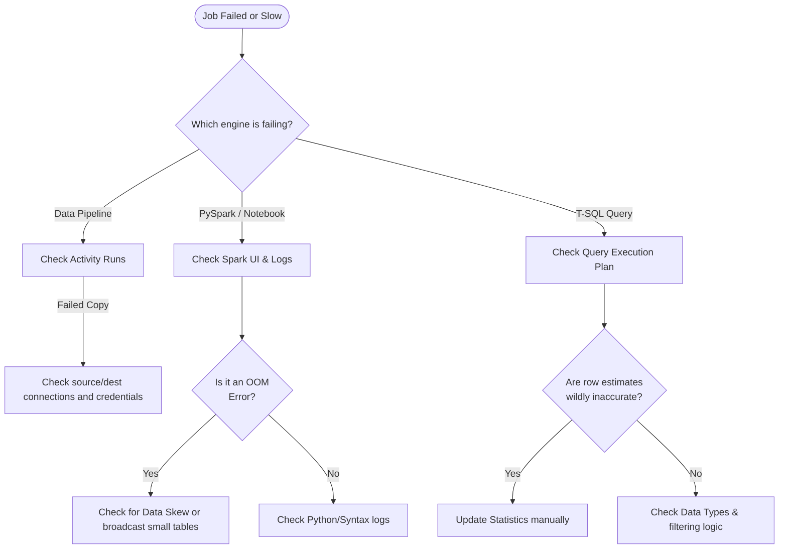

# 10. Optimization & Troubleshooting

When an analytics solution scales from gigabytes to terabytes, unoptimized code that used to work fine will begin to fail or cost exorbitant amounts of compute. 

## 1. Spark and Lakehouse Optimization

When working with PySpark and Delta tables, query performance heavily depends on how data is physically stored on disk.

### Delta Table Optimizations
- **V-Order:** A write-time optimization applied automatically by the Fabric Spark engine to Parquet files. It sorts and compresses the data in a way that enables lightning-fast reads by the Power BI VertiPaq engine and the SQL engine. (Enabled by default in Fabric).
- **The OPTIMIZE Command:** Over time, streaming data or frequent small updates can cause the "Small File Problem" (thousands of 1KB files). This severely slows down read performance. Running `OPTIMIZE` compacts these small files into larger, optimal sizes (usually around 1GB).
  ```sql
  OPTIMIZE MyLakehouseTable;
  ```
- **Partitioning:** Dividing a large table into physical folders on disk based on a column (e.g., `/Year=2024/Month=01/`).
  - *Best Practice:* Do **not** partition on a column with high cardinality (like `CustomerID` or `Timestamp`). You will create millions of tiny folders.
  - *Rule of Thumb:* Only partition a table if you expect to have at least 1 GB of data *per partition folder*.

### Spark Job Troubleshooting
- **Out of Memory (OOM) Errors:** The most common Spark error. Often caused by **Data Skew** (e.g., when joining tables on a `Null` value, causing one single executor to process 99% of the data while the others sit idle and crash).
  - *Solution:* Filter out nulls before joining, or use Broadcast Hash Joins for smaller lookup tables.
- **Spark UI:** Accessible via the Monitoring Hub, the Spark UI shows the physical DAG and helps identify exactly which executor or stage of a job is hanging.

## 2. SQL and Warehouse Optimization

For Fabric Warehouses and SQL Endpoints:
- **Statistics:** The SQL engine uses statistics (histograms of data distribution) to determine the best execution plan (e.g., choosing a Hash Match vs Nested Loop join). Fabric automatically creates statistics, but you can manually update them if query performance drops suddenly after a massive data load.
- **Data Types:** Use the smallest appropriate data type. Using `VARCHAR(MAX)` when `VARCHAR(50)` would suffice wastes massive amounts of memory during query execution and slows down sorts/hashes.

## 3. Troubleshooting Decision Tree

When faced with a failing or slow job, use this logical flow:



---

## 🧠 Knowledge Check

Test your understanding of Optimization & Troubleshooting:

1. **Scenario:** You are writing data into a Delta table every 5 minutes from a streaming source. After a month, queries against this table take 10 minutes to run. What is the likely cause, and how do you fix it?
   - *Answer:* The likely cause is the "Small File Problem" (thousands of tiny files created by frequent micro-batch writes). You fix it by scheduling a notebook to run the `OPTIMIZE TableName;` command periodically to compact the files.

2. **Question:** You are creating a Delta table that will hold 50 GB of data. You decide to partition the table by `TransactionDate` (which has a unique timestamp down to the second). Is this a good idea?
   - *Answer:* No. Partitioning by a highly granular timestamp will create millions of tiny partition folders, severely degrading performance. You should only partition if each partition will hold ~1 GB of data (e.g., partition by `Year` or `Month` instead).

3. **Question:** What does the V-Order optimization do in Microsoft Fabric?
   - *Answer:* It applies special sorting and compression to Parquet files at write-time, significantly speeding up read operations for the Power BI and SQL engines.

---
**Next Topic:** [[11_Decision_Guides_and_Architecture]]
