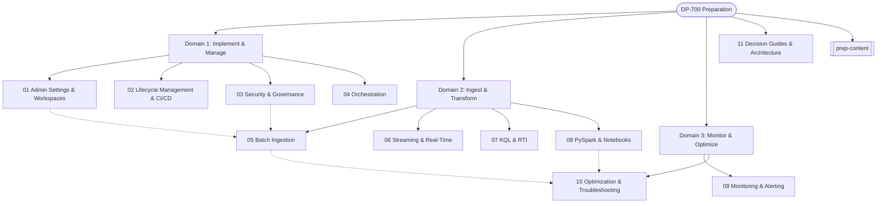

# DP-700 Study Dashboard: Fabric Data Engineer

Welcome to the DP-700 Study Vault! This guide is comprehensively organized into the three main Microsoft exam domains, plus architectural decision guides and strategy.

## 🗺️ Learning Path

## 📚 Exam Domains

### [[Domain_1_Implement_and_Manage]] (30-35%)
Focuses on workspaces, lifecycle management, deployment pipelines, security, and orchestration.

### [[Domain_2_Ingest_and_Transform]] (30-35%)
Focuses on batch/streaming data patterns, data stores (Lakehouse, Warehouse, KQL), and transformations using PySpark, T-SQL, and KQL.

### [[Domain_3_Monitor_and_Optimize]] (30-35%)
Focuses on the Monitoring Hub, error handling, performance tuning (Spark, Delta, SQL), and alerting.

## 🏛️ Additional Resources
- [[11_Decision_Guides_and_Architecture|Decision Guides & Architecture]]: How to choose between different Fabric engines and items.
- [[prep-content|Official Syllabus & Study Plan]]: The detailed exam checklist, strategy, and official links.

---
> *Tip: Use `Ctrl + Click` to navigate the links in this Obsidian vault. Follow the numbers `01` to `11` for a structured learning flow.*