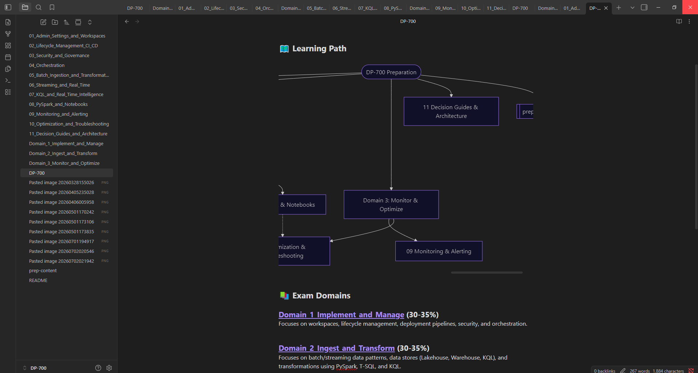
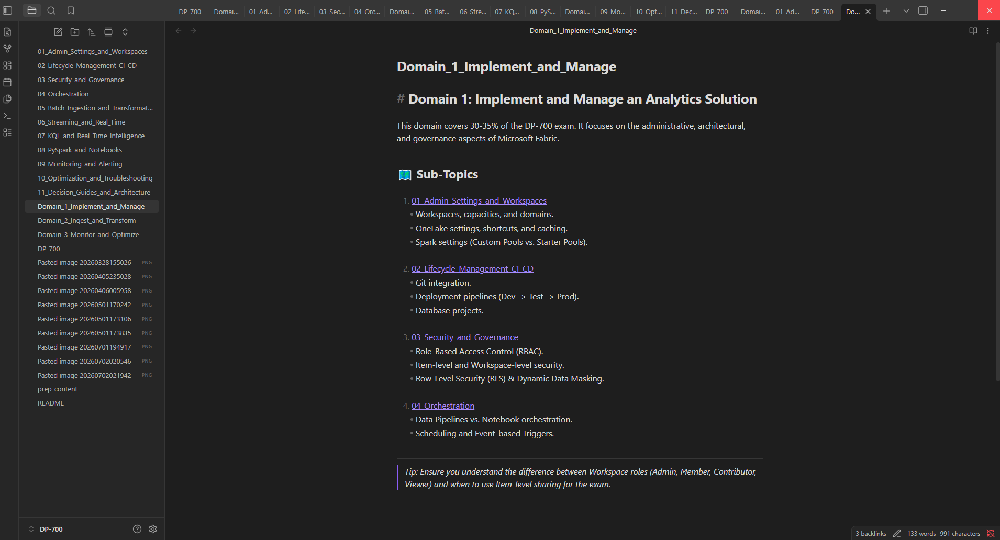
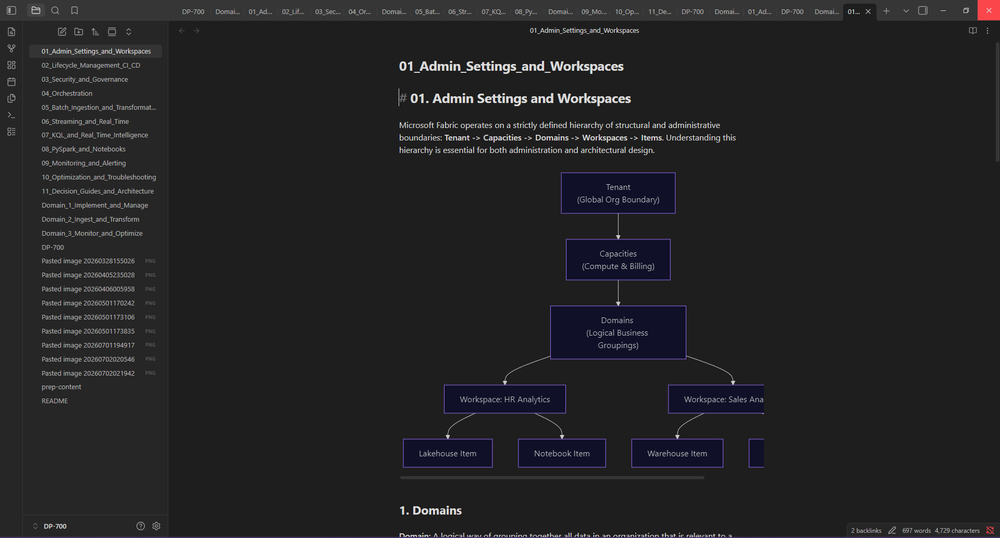

# 🚀 DP-700 Exam Preparation Vault


Welcome to the ultimate, structured study guide for the **Microsoft DP-700: Implementing and Managing a Microsoft Fabric Data Analytics Solution** certification exam.

> **Created by:** Ridouan LACHGAR  
> **Story:** I built and used this exact Obsidian vault to prepare for and pass the DP-700 certification exam with a score of **882**. I organized all the scattered MS Learn documentation, personal notes, and architectural diagrams into this single repository. I hope it helps you achieve the same success!

---

## 📖 What is the DP-700 Exam?
The DP-700 exam measures your ability to design, implement, and manage enterprise-scale data analytics solutions using Microsoft Fabric. It covers everything from configuring Fabric workspaces and security to ingesting data, orchestrating pipelines, and writing complex PySpark/KQL transformations.

## ✨ Features of this Study Guide
- **Comprehensive Coverage:** Notes are mapped directly to the official DP-700 Skills Measured syllabus.
- **Architectural Diagrams:** Visual representations of CI/CD flows, Spark architecture, and security hierarchies using Mermaid.js.
- **Interactive Knowledge Checks:** At the bottom of every core topic, you'll find exam-style scenario questions to test your retention.
- **Decision Guides:** Specific cheat sheets on *when* to use Lakehouses vs. Warehouses, or Pipelines vs. Notebooks (a heavy focus on the exam).

---

## 🌟 How to Use This Repository (Important!)

This repository is built as an **Obsidian Vault**. While you can browse the `.md` files directly on GitHub, **for the best experience, you must open this folder using Obsidian.**

[Obsidian](https://obsidian.md/) is a powerful, free knowledge base app that works on top of a local folder of plain text Markdown files. By opening this repository as an Obsidian vault, you will benefit from:

1. **Interactive Mermaid Diagrams:** All architectural flows and Entity-Relationship diagrams will render perfectly.
2. **Backlinks & Navigation:** You can click on double-bracketed links (e.g., `[[01_Admin_Settings_and_Workspaces]]`) to jump instantly between interconnected topics.
3. **Embedded Images:** You will be able to see all the screenshots and diagrams directly in line with the text.
4. **The "DP-700 Dashboard":** The vault contains a `DP-700.md` home file that acts as your central dashboard for learning.

### Quick Start Guide:
1. Clone or download this repository to your local machine:
   ```bash
   git clone https://github.com/redonelach1/DP-700-Exam-Preparation-Content.git
   ```
2. Download and install [Obsidian](https://obsidian.md/).
3. Open Obsidian and click **"Open folder as vault"**.
4. Select the downloaded `DP-700-Exam-Preparation-Content` folder.
5. In the file explorer on the left, click on **`DP-700.md`** to start your learning journey!

---

## 📸 Vault Preview

Here is a glimpse of what the study guide looks like when opened correctly in Obsidian:

### The DP-700 Dashboard


### Structured Study Domains


### Rendered Diagrams and Notes


---

## 📚 Curriculum Structure

The vault is divided into 11 core topics, logically categorized into the 3 Main Exam Domains:

### Domain 1: Implement and Manage
*Focus: Workspaces, Lifecycle, Security, and Pipelines*
- `01` Admin Settings & Workspaces
- `02` Lifecycle Management & CI/CD
- `03` Security and Governance
- `04` Orchestration (Pipelines & Notebooks)

### Domain 2: Ingest and Transform
*Focus: Moving data, Star Schemas, PySpark, and Real-Time*
- `05` Batch Ingestion & Transformation
- `06` Streaming & Real-Time Intelligence
- `07` Kusto Query Language (KQL)
- `08` PySpark & Notebooks

### Domain 3: Monitor and Optimize
*Focus: Keeping the Fabric tenant healthy and performant*
- `09` Monitoring & Alerting (Capacity Metrics)
- `10` Optimization & Troubleshooting (V-Order, Delta Optimization)
- `11` Architecture Decision Guides (Choosing the right engine)

---

## 🤝 Support & Contribution
If you found this study guide helpful in passing your DP-700 exam, please consider giving the repository a ⭐ **Star** on GitHub! 

If you notice any outdated information as Microsoft Fabric evolves, feel free to open an Issue or submit a Pull Request.

*Disclaimer: This repository is a personal study guide and is not officially affiliated with or endorsed by Microsoft.*